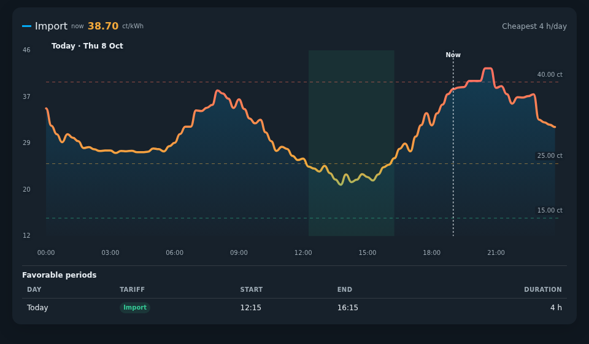
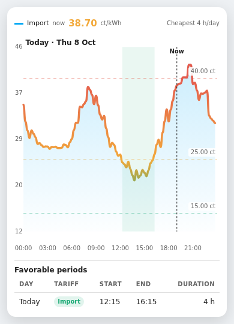
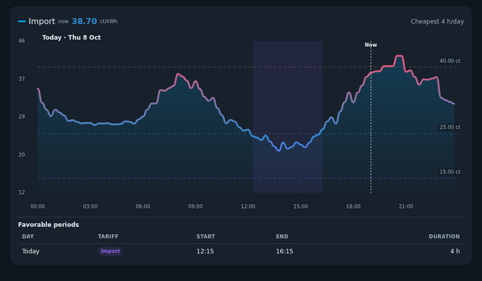
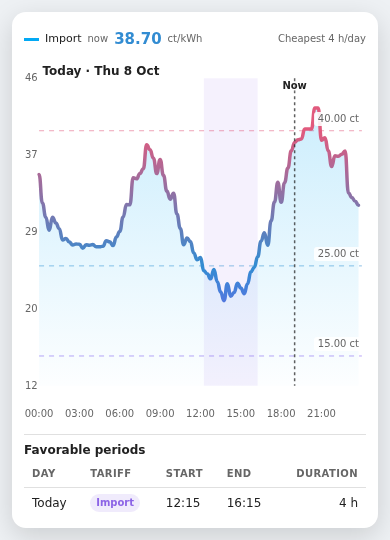

# Dynamic Energy Price Card

**See electricity prices at a glance—and find the best times to use or export energy.**

A compact Home Assistant dashboard card for dynamic electricity tariffs. View the current price, follow today's price curve, and highlight favorable periods. Add a second sensor to compare import and export prices on the same chart.



## What it can do

- **Plan energy use:** highlight the cheapest import periods and highest-paying export periods.
- **Choose useful time blocks:** select individual intervals, one continuous block, or multiple blocks with a minimum duration.
- **See today and tomorrow:** show available upcoming prices, the current price, and a clear Now marker.
- **Inspect any interval:** use hover, touch, or keyboard controls to read prices.
- **Make it your own:** customize price colors, period highlights, line styles, and optional fills—or keep the original appearance.
- **Keep your dashboard compact:** use a responsive chart, optional period table, and Home Assistant's native visual editor and Sections sizing.

Works with hourly or quarter-hour price intervals in the supported sensor format. Import-only is the default; export is optional. The card displays data from your sensors—it does not fetch tariffs or control appliances.

## Quick start

### 1. Install with HACS

1. Open **HACS** in Home Assistant.
2. Open **Custom repositories** from the menu.
3. Add `https://github.com/hidder11/dynamic-energy-price-card` with category **Dashboard**.
4. Install **Dynamic Energy Price Card**, then refresh your browser.

### 2. Add a card

Use Home Assistant's visual editor, or start with this YAML:

```yaml
type: custom:dynamic-energy-price-card
entity: sensor.tibber_prijzen
cheapest_hours: 4
import_selection_mode: contiguous
show_cheapest_table: true
```

Replace `entity` with your price sensor. This example highlights the cheapest continuous four-hour block per day and lists it below the chart. Omit the last three settings if you only want the price graph.

**Sensor requirement:** the sensor must provide a `data` attribute with timestamped prices in EUR/kWh. A sensor with only a current-price state is not enough. See **Sensor data** below for the exact format.

## Examples

The opening preview and examples below use real Tibber tariff data from October 8, 2026: 96 quarter-hour intervals read from `sensor.tibber_prijzen`. They were captured from the built card on a standalone Home Assistant-style surface, not a live dashboard. Card labels are English. Each uses import only, a hidden title, and the same continuous four-hour selection (12:15–16:15). Default and custom-color examples use the same data, layout and fixed example clock (19:00 Europe/Amsterdam). The one-day snapshot omits tomorrow; `tomorrow_after: 24` suppresses tomorrow warnings in these examples only. The normal default remains `14`.

The reproducible snapshot and standalone viewer are in `docs/examples/`; the deliberately synthetic stress-test data stays separate in `qa/`.

### Original palette — compact light mobile

The same compact summary, chart and favorable-period table on mobile:



### Custom price colors and independent period highlights

Blue and rose price colors with an independent purple favorable-period highlight. Changing these colors does not change the layout or selected period.





Example settings:

```yaml
show_title: false
cheapest_hours: 4
import_selection_mode: contiguous
show_cheapest_table: true
tomorrow_after: 24 # One-day README example only; normal default is 14.
cheap_color: [130, 90, 240]
normal_color: [50, 140, 210]
expensive_color: [225, 90, 125]
import_favorable_color: [140, 100, 230]
```

Export-period colors can be customized independently with `export_favorable_color`. Leave any color empty to retain its original default.

## Sensor data

Use an import sensor whose `data` attribute contains an array of intervals. Each interval must include an ISO timestamp with a timezone offset and a price in EUR/kWh:

```yaml
start_time: "2026-10-07T14:00:00+02:00"
price_per_kwh: 0.2345
```

An optional `export_entity` uses the same format. It is required when export prices are shown. The offset is applied to that entity:

```text
export price = export entity price + export_price_offset
```

Offsets may be negative. The import entity is never used as the base for an export offset.

## Configuration examples

Most settings can be changed in Home Assistant's native visual editor. The examples below show the equivalent flat YAML keys.

### Import-only configuration

An import-only setup with price guides, fading fill, and a four-hour selection in blocks of at least 30 minutes:

```yaml
type: custom:dynamic-energy-price-card
entity: sensor.tibber_prijzen
title: Dynamic energy prices
show_title: true
show_hover_line: true
show_average_line: false
show_price_levels: true
import_line_style: solid
import_line_width: 3.5
show_import_fill: true
import_fill_fade: true
import_selection_mode: minimum_blocks
import_minimum_duration: 30
cheap_price: 0.15
normal_price: 0.25
expensive_price: 0.40
cheapest_hours: 4
show_cheapest_table: true
tomorrow_after: 14
```

### Import and export entities

```yaml
type: custom:dynamic-energy-price-card
entity: sensor.dynamic_import_prices
export_entity: sensor.dynamic_export_prices
graph_mode: both
current_price_mode: both
show_average_line: true
cheap_price: 0.15
normal_price: 0.25
expensive_price: 0.40
cheapest_hours: 4
export_best_hours: 4
show_cheapest_table: true
show_export_table: true
tomorrow_after: 14
```

### Correct an export entity with an offset

```yaml
type: custom:dynamic-energy-price-card
entity: sensor.dynamic_import_prices
export_entity: sensor.dynamic_export_prices
export_price_offset: -0.12
graph_mode: both
current_price_mode: export
export_best_hours: 3
show_export_table: true
```

## Language

The card automatically follows the Home Assistant user's frontend language: Dutch for `nl` (including regional variants), and English for English or any unsupported language. This covers the native visual editor, selector options and helper text, chart labels, tables, hover details, errors, and screen-reader announcements. Dates, decimal separators and duration labels follow the same language; times retain a compact 24-hour format in Home Assistant's configured timezone.

The default title is translated automatically. A title explicitly entered in YAML or the editor is always preserved literally—even if it matches an old default title. Remove `title` to restore the automatic title. No language setting or nested configuration is required.

## Settings reference

| Option | Required | Default | Description |
|---|---:|---:|---|
| `entity` | Yes | — | Import sensor containing intervals in `attributes.data`. |
| `export_entity` | No | — | Export sensor with the same data format. Required when export information is shown. |
| `export_price_offset` | No | — | Signed EUR/kWh correction applied to the export entity prices. |
| `graph_mode` | No | `import` | Graph series: `import`, `both`, or `export`. |
| `current_price_mode` | No | `import` | Current metrics: `import`, `both`, `export`, or `none`. |
| `title` | No | Localized automatically | `Dynamic energy prices` / `Dynamische energieprijzen`. Explicit text is preserved literally. |
| `show_title` | No | `true` | Shows the title. When hidden, active favorable-period context uses its position. |
| `show_hover_line` | No | `true` | Shows a guide line for the active tooltip interval. |
| `show_average_line` | No | `false` | Shows a separately labelled average for each visible graph series. |
| `show_price_levels` | No | `true` | Shows the cheap, normal, and expensive reference lines and their price labels. |
| `import_line_style` | No | `solid` | Import line style: `solid`, `dashed`, or `dotted`. |
| `import_line_width` | No | `3.5` | Import line thickness from 1 to 8 px. |
| `import_line_color` | No | — | Optional RGB color override. Empty keeps automatic threshold colors. |
| `show_import_fill` | No | `true` | Shows a transparent fill below the import line. |
| `import_fill_color` | No | — | Optional RGB fill color. Empty uses the Home Assistant primary color. |
| `import_fill_fade` | No | `true` | Fades the import fill towards the bottom of the chart. |
| `import_selection_mode` | No | `individual` | `individual`, `contiguous`, or `minimum_blocks`. |
| `import_minimum_duration` | No | `30` | Minimum block duration in minutes for `minimum_blocks`. |
| `export_line_style` | No | `dashed` | Export line style: `solid`, `dashed`, or `dotted`. |
| `export_line_width` | No | `3.5` | Export line thickness from 1 to 8 px. |
| `export_line_color` | No | — | Optional RGB color override. Empty keeps automatic reversed threshold colors. |
| `show_export_fill` | No | `false` | Shows a transparent fill below the export line. |
| `export_fill_color` | No | — | Optional RGB fill color. Empty uses the export highlight blue. |
| `export_fill_fade` | No | `true` | Fades the export fill towards the bottom of the chart when enabled. |
| `export_selection_mode` | No | `individual` | `individual`, `contiguous`, or `minimum_blocks`. |
| `export_minimum_duration` | No | `30` | Minimum block duration in minutes for `minimum_blocks`. |
| `cheap_color` | No | Theme success color | Optional RGB override for favorable price semantics: low import / high export. |
| `normal_color` | No | `#f2a93b` | Optional RGB override for normal prices. |
| `expensive_color` | No | Theme error color | Optional RGB override for unfavorable price semantics: high import / low export. |
| `zero_color` | No | `#18a999` | Optional RGB override for the zero-price anchor in the import gradient. |
| `negative_color` | No | `#168aad` | Optional RGB override for negative import prices and markers. |
| `import_favorable_color` | No | Theme success color | Independent favorable import bands, legend, active-period badges, and table labels. Not linked to `cheap_color`. |
| `export_favorable_color` | No | `#1976d2` | Independent favorable export bands, legend, active-period badges, and table labels. Also supplies the automatic export fill color unless `export_fill_color` is set. |
| `cheap_price` | No | `0.15` | Low threshold in EUR/kWh. Low import is favorable; low export is unfavorable. |
| `normal_price` | No | `0.25` | Middle gradient anchor in EUR/kWh. |
| `expensive_price` | No | `0.40` | High threshold in EUR/kWh. High import is unfavorable; high export is favorable. |
| `cheapest_hours` | No | `0` | Lowest import duration selected per day. `0` disables it. |
| `export_best_hours` | No | `0` | Highest export duration selected per day. `0` disables it. |
| `show_cheapest_table` | No | `false` | Shows selected import periods when `cheapest_hours` is enabled. |
| `show_export_table` | No | `false` | Shows selected export periods when `export_best_hours` is enabled. |
| `tomorrow_after` | No | `14` | Local hour after which available tomorrow intervals become visible. |

Thresholds must be ordered as:

```text
cheap_price < normal_price < expensive_price
```

The visual editor groups configuration under **General**, **Import**, and **Export**. Price thresholds and the expandable **Price colors** (`Prijskleuren`) subgroup are in **General**. Independent period colors are in each tariff's **Favorable periods** subgroup. All settings are stored as flat YAML keys, so existing configurations remain compatible.

### Colors and overrides

- Colors are RGB arrays with three channels from `0` to `255`; `[0, 0, 0]` is valid black.
- Remove a key or clear its selector to restore its default. Empty arrays and `null` also reset safely.
- Price colors and favorable-period colors are independent: changing one does not recolor the other.
- Price colors apply to gradients, current-price values, reference lines, and hover markers. Export keeps the reversed meaning: high prices are favorable.
- `zero_color` controls the import gradient's zero-price anchor, not price classification.
- Fixed `import_line_color` and `export_line_color` override automatic line and marker colors. Explicit fill colors remain independent.
- Leaving the new colors unset preserves the original palette, opacity, spacing, and layout.

An export source is required only when the selected graph mode, current-price mode, or export-period selection uses export data. The card displays a configuration error with recovery guidance when such a source is missing.

## Favorable periods

`cheapest_hours` chooses the lowest-priced import duration per calendar day. `export_best_hours` independently chooses the highest-priced export duration. Each tariff supports three modes:

- `individual`: the best loose intervals;
- `contiguous`: one best contiguous block;
- `minimum_blocks`: the best one or more blocks, where every block meets the configured minimum duration.

Selected import and export periods share one table and remain clearly labelled.

With quarter-hour data and a value of `4`, sixteen intervals are selected per day.

## Interaction and accessibility

- Hover, pointer drag, and touch show all visible series for the nearest interval.
- Missing values in a partially aligned series are shown as `—` without hiding the other series.
- Import and export markers are separate round HTML elements, so they remain circular when the graph resizes.
- The graph is keyboard focusable. Use Left/Right, Home, End, and Escape.
- Tooltip text is mirrored to an `aria-live` region.
- Tapping outside the chart dismisses a touch tooltip.
- Clicking an import or export legend item toggles that graph series without changing the saved configuration.

## Sections view sizing

In a Home Assistant **Sections** view, use the card's **Layout** tab to change its height. The graph grows or shrinks with the allocated space. Enabling either table selects the taller default; tables scroll internally at smaller supported heights.

## Troubleshooting

### No import data

- Confirm that `entity` exists.
- Check **Developer Tools → States**.
- Verify `attributes.data` is an array containing `start_time` and `price_per_kwh`.
- Verify timestamps include a valid timezone offset.

### Export source required

Configure `export_entity`, or change export-dependent modes and selections back to import-only settings.

### Tomorrow is missing

Check the configured `tomorrow_after` hour and whether the source sensor already contains tomorrow's intervals.

## Development

```bash
npm test
npm run build
```

The build writes the standalone HACS bundle to:

```text
dist/dynamic-energy-price-card.js
```

Do not edit the generated bundle directly. Browser localization checks and screenshot reproduction are documented in `docs/QA-LOCALIZATION.md`; run `window.checkLocalization()` from the standalone `/qa/` viewer. Serve the repository root so both `qa/` and `docs/examples/` can load the built bundle.

## License

MIT
